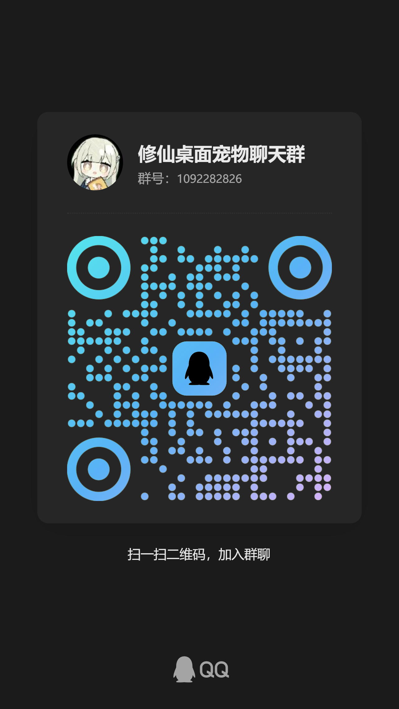

# 🎮 修仙宠物 (Xiuxian Pet)

**中文** | [English](docs/README_EN.md)

<p align="center">
  
</p>

<p align="center">
  <b>一个会修仙的桌面宠物，陪伴你摸鱼、修炼、飞升！</b>
</p>

<p align="center">
  
  
  
  
  
</p>

---

## ✨ 项目简介

**修仙宠物**是一款休闲、幽默风格的桌面宠物游戏，灵感源自《凡人修仙传》。你的桌面上会有一只可爱的小宠物，它会自动修炼、突破境界、穿戴装备，还能陪你聊天解闷！

> 🎯 **核心理念**：工作累了？来看看你的宠物修炼到什么境界了吧！说不定它已经飞升成仙，而你还在写 bug~ 😏

---

## 🖼️ 游戏截图

<p align="center">
  
  
</p>

---

## 🚀 核心功能

### 🎭 桌面宠物系统

- **自动修炼**：宠物会自己打坐修炼，智慧属性影响修炼速度，无需操心
- **手动修炼**：点击修炼获取修为，悟性属性影响修炼效果
- **境界突破**：从炼气期(13层) → 筑基期 → 结丹期 → 元婴期 → 化神期 → 炼虚期 → 合体期 → 大乘期 → 真仙境 → 金仙境 → 太乙境 → 大罗境 → 道祖境，完整修仙之路
- **小境界突破**：每个大境界分为初期/中期/后期/大圆满(炼气期为13层)
- **六维属性**：攻击、生命、防御、智慧、悟性、灵力六大属性
- **正态分布成长**：属性成长基于正态分布随机因子，每次升级/突破都有差异
- **努力加成**：点击修炼越勤奋，属性成长越额外加成
- **境界压制**：大境界差距越大，战斗力倍率越高(10^n指数级差距)
- **GIF动画桌面宠物**：桌面宠物以GIF动画形式展示，可自由切换
- **点击加速动画**：点击宠物越快，GIF动画越快；停止点击后逐渐减速
- **气泡浮动文字**：修为+X 等提示信息以气泡形式随机飘浮显示
- **系统托盘提示**：鼠标悬浮托盘图标显示角色信息
- **隐藏境界**：花费灵石隐藏真实修为，防止被其他玩家探查

### 🛡️ 装备系统

- **多部位装备**：武器、防具、法宝等多种装备类型
- **装备穿戴/卸载**：自由搭配装备，法宝可装备多个
- **装备属性加成**：self_buff 自身加成 + enemy_buff 对方削弱
- **灵力系统**：法宝消耗灵力，灵力属性限制法宝装备数量
- **装备分解**：分解不需要的装备获取灵石和庚金
- **装备锁定**：锁定重要装备防止误分解
- **背包管理**：200格背包容量，支持扩展（+50格/次，费用翻倍）
- **装备掉落**：战斗和秘境中有概率掉落装备
- **境界修为限制**：高等级装备需要足够修为才能穿戴
- **装备强化**：真化/敕化两阶强化，概率随等级衰减，失败返还半价材料
- **六大装备部位**：武器、防具、护腿、头盔、靴子、法宝，自由搭配

### 🗡️ 刷怪系统

- **七级难度**：蔡坤、入门、低级、中级、高级、专家、地狱，难度递增
- **魔化/仙化修饰**：可叠加任意难度等级，大幅提升经验奖励
- **自动刷怪**：设置后自动战斗，解放双手
- **随机PVP匹配**：刷怪中可能遭遇其他玩家

### ⚔️ 战斗系统

- **回合制战斗**：完整的回合制战斗流程
- **先手判定**：境界高者先手，同境界概率判定
- **暴击机制**：智慧属性影响暴击率
- **闪避机制**：悟性属性影响闪避率
- **法宝战斗**：战斗中自动使用法宝，提供临时属性加成
- **灵力燃烧**：无法宝时燃烧灵力获取伤害加成
- **境界倍率**：境界差距决定战斗力指数级差异
- **PVP对战**：与其他玩家一决高下
- **战斗力计算**：综合属性、境界、装备的完整战斗力评估体系
- **境界名称颜色**：不同境界显示不同颜色，一眼辨别修为高低
- **战斗文字**：丰富的战斗描述文本，修仙风叙事

### 🤖 AI 智能聊天

- **本地大模型**：基于 Ollama，无需联网也能聊天
- **智能感知**：检测系统闲置状态(CPU/内存/GPU/输入设备)，自动找你聊天
- **多地方言**：东北话、天津话、北京话、四川话、孙笑川风格任选
- **气泡对话**：可爱的气泡对话框，逐字显示动画效果
- **剪贴板读取**：自动读取剪贴板内容作为对话上下文
- **屏幕截图**：截取屏幕作为对话输入
- **本地知识库**：基于向量数据库的本地知识库，定时导入历史聊天记录
- **用户手动聊天**：支持快捷键唤起手动聊天
- **聊天记录管理**：自动保存和压缩聊天历史

### 🗺️ 秘境探索

- **随机迷宫生成**：基于DFS算法生成随机迷宫，环路概率可调
- **七大秘境**：
  | 秘境 | 开放时间 | 最低境界 | 难度 |
  |------|---------|---------|------|
  | 🩸 血色禁地 | 周一/三/五/日 | 筑基期 | ⭐ |
  | 🏛️ 虚天殿 | 周二/四/六/日 | 结丹期 | ⭐⭐ |
  | 👹 坠魔谷 | 周一/三/日 | 元婴期 | ⭐⭐⭐ |
  | ⛰️ 昆吾山 | 周二/四/五 | 元婴期 | ⭐⭐⭐⭐ |
  | 💀 冥河之地 | 周一/三 | 化神期 | ⭐⭐⭐⭐⭐ |
  | 🌙 广寒界 | 周二/四 | 化神期 | ⭐⭐⭐⭐⭐ |
  | 🎆 新年广场 | 周五/日 | 炼虚期 | ⭐⭐⭐ |
- **WASD移动**：流畅的键盘控制移动
- **自动寻路**：A*算法自动寻路到出口
- **自动战斗**：寻路过程中自动战斗
- **四种地图元素**：人物(蓝)、非人物(红)、资源(紫)、加成(绿)
- **六级强度**：越靠近出生点角色越强
- **战争迷雾**：视野范围内的区域才会显示
- **缩放功能**：鼠标滚轮缩放地图
- **生命值系统**：被击败可花费灵石复活
- **通关奖励**：灵石、修为、属性加成
- **每日挑战次数**：每个秘境每日有进入次数限制
- **FPS显示**：实时帧率监控
- **用时统计**：记录通关用时，刷新最佳记录

### 💰 经济系统

- **三种货币**：灵石、庚金、仙玉
- **灵石获取**：修炼、战斗、秘境、分解装备
- **庚金获取**：分解装备
- **仙玉获取**：修炼

### 🔌 插件系统（亮点功能）

> 🌟 **这是本项目最引以为傲的功能！**

我们设计了一套**跨语言插件架构**，让第三方开发者可以用任何语言（Python、Go、C++ 等）为游戏开发插件！

#### 插件系统特点

- 🛡️ **进程隔离**：插件运行在独立进程中，崩溃不影响主程序
- 🔐 **加密通信**：Python 与 Go 之间使用 AES 加密通信
- 📡 **标准化协议**：统一 JSON 消息格式，易于开发
- 🔄 **自动重启**：插件崩溃后自动重启，高可用性
- 📦 **创意工坊**：内置插件市场，一键安装热门插件
- 💓 **心跳监控**：实时监控插件在线状态
- 🔑 **MD5校验**：插件文件完整性验证

#### 通信协议

插件通过 Go 桥接服务器 (`xiuxian_ps.exe`) 与主程序通信：

```
插件进程  ──TCP(明文)──▶  Go桥接 :15433  ──AES加密TCP──▶  Python主程序
```

- 消息格式：`[4字节大端序长度][JSON消息体]`
- 消息结构：`type`、`plugin_id`、`msg_uuid`、`timestamp`、`data`
- 心跳机制：每30秒一次，超过5分钟无活动自动注销

#### 插件 API 接口

通过 `exec_method` 调用游戏方法，所有返回格式为 `{"status":1/0, "msg":"...", "data":...}`：

| 命令 | 参数 | 说明 |
|------|------|------|
| `get_player_attr` | `(属性名, 默认值)` | 获取玩家属性，`"root"` 返回全部信息 |
| `set_player_attr` | `(属性名, 属性值)` | 设置玩家属性 |
| `get_plugin_attr` | `(属性名, 默认值)` | 获取插件专属数据（命名空间隔离） |
| `set_plugin_attr` | `(属性名, 属性值)` | 存储插件私有数据 |
| `sys_exit` | `(退出码, 校验码)` | 安全退出客户端（校验码为 `get_version()`） |
| `send_player_peer_info` | 无 | 获取玩家P2P节点信息 |
| `recv_player_peer_info` | `(peer_data)` | 接收远程玩家P2P数据 |

#### 开发一个插件有多简单？

```go
package main

import (
    "anti-cheat/acore"
    "anti-cheat/atypes"
    "os"
)

func main() {
    // 初始化插件
    plugin := acore.NewAntiCPlugin(
        "my_plugin",       // 插件唯一ID
        "我的插件",         // 插件名称
        "1.0.0",           // 版本号
        "windows",         // 平台
        "1.7.1",           // 客户端版本
        15,                // 检测间隔(秒)
    )
    // 连接桥接服务 TCP 127.0.0.1:15433
    if !plugin.Connect("127.0.0.1", 15433) { os.Exit(1) }
    // 注册插件
    if !plugin.Register() { plugin.Stop(); os.Exit(1) }
    // 启动心跳(30秒/次)
    plugin.StartHeartbeat()

    // 调用游戏API示例
    plugin.SendMessage(atypes.Message{
        Type: "exec_method",
        Data: map[string]interface{}{
            "method_name": "get_player_attr",
            "args":        []interface{}{"level", 0},
        },
    })
    // 插件主逻辑...
    select {}
}
```

### 🛡️ 安全防护

- **反逆向工具**：检测 IDA、x64dbg、OllyDbg、Ghidra、WinDbg、Cheat Engine 等工具（正则匹配，不怕改名）
- **DLL 注入检测**：实时监控异常模块加载
- **远程线程注入检测**：检测线程起始地址是否在模块范围内
- **禁止双开**：基于 PID 文件锁，防止多开刷资源
- **双层 AES 加密**：Fernet + AES-CBC 双层加密存储游戏数据
- **SQLite 存储**：事务保证数据原子性

### 🐾 P2P 宠物系统

- **局域网发现**：UDP 15440 端口自动广播发现局域网内其他宠物
- **宠物同步**：位置、皮肤、境界、属性等信息实时同步
- **HTTP 数据拉取**：通过 HTTP 15441 端口获取完整加密数据（AES-256，密钥为玩家 UUID）
- **消息转发**：变更事件通过插件桥接架构转发到远程玩家
- **变更实时推送**：位置移动、皮肤更换、聊天消息等操作实时广播

### 🌐 内网隧道（WireGuard）

基于 WireGuard 构建**虚拟局域网**，让异地玩家如同处于同一局域网，实现跨地域联机。

#### 工作原理

```
玩家A (家庭网络)              WireGuard服务器              玩家B (家庭网络)
┌──────────────┐            ┌──────────────┐            ┌──────────────┐
│ 物理网卡      │            │  Hub 模式    │            │ 物理网卡      │
│ 192.168.1.x  │  WireGuard │              │  WireGuard │ 192.168.2.x  │
│              │◀════════▶│ 123.56.x.x    │◀════════▶│              │
│ 虚拟网卡      │  UDP:10220 │              │  UDP:10220 │ 虚拟网卡     │
│ 10.0.0.5     │            │              │            │ 10.0.0.6     │
│              │            └──────────────┘            │              │
│ P2P UDP:15440│ ◀════    10.0.0.0/24 虚拟子网    ════▶│ P2P UDP:15440│
│ HTTP:15441   │   ◀════════════════════════════▶      │ HTTP:15441  │
└──────────────┘            虚拟局域网                   └──────────────┘
```

#### 联机流程

1. **安装服务**：首次使用需管理员权限安装 WireGuard 系统服务（`WireGuardManager`）
2. **启动连接**：自动生成密钥对 → 服务器 DHCP 分配隧道 IP（`10.0.0.x`） → 注册公钥 → 建立加密隧道
3. **自动发现**：P2P 宠物插件的 UDP 广播通过虚拟网卡自动到达所有隧道内玩家
4. **实时同步**：皮肤、位置、境界等数据通过 AES 加密 HTTP 传输

#### 隧道特性

- **内嵌二进制**：WireGuard 核心和命令行工具打包内嵌，无需用户单独安装
- **自动密钥管理**：本地生成密钥对，服务器端注册与分配
- **服务监控**：每5秒检查隧道服务状态，每15秒验证隧道连通性
- **流量统计**：实时显示隧道传输数据（`wg show`）
- **自动重连**：支持启动/停止/重启/卸载完整生命周期管理
- **跨平台**：支持 Windows、Linux、macOS
- **独立于游戏服务器**：P2P 实时交互不经过中心服务器，仅隧道注册依赖服务器

### 🏯 宗门系统

- **职位体系**：宗主、长老、真传弟子、核心弟子、杂役弟子，各有权限
- **护宗大阵**：宗门集体防御增益
- **修炼加速**：宗门贡献灵石可获得修炼速度加成

### 🏪 拍卖行

- **上架/下架/改价**：灵活的物品交易管理
- **多条件搜索**：按境界、强化等级、BUFF类型筛选
- **自动估价**：智能估算装备市场价值

### 🏆 排行榜

- **战力榜**：综合战斗力排名
- **装备榜**：最强装备展示
- **秘境通关榜**：通关速度排名
- **开挂检测榜**：作弊玩家公示

### 📬 邮件与公告

- **邮件系统**：收发系统邮件和个人消息
- **公告系统**：查看服务器最新公告

### 🌐 内置浏览器

- **多标签页**：支持同时浏览多个页面
- **自定义UA/Headers/代理**：灵活配置请求
- **开发者工具**：内置调试工具
- **Cookie持久化**：自动保持登录状态

### ☁️ 云存档

- **数据上传/下载**：将游戏数据同步到服务器
- **密钥恢复**：通过服务器备份恢复密钥文件
- **皮肤社区分享**：上传/下载社区分享的宠物皮肤

### ⚙️ 系统功能

- **窗口置顶**：宠物窗口始终显示在最前面
- **主题切换**：支持多种界面主题
- **跨平台开机自启**：支持 Windows(注册表/启动文件夹)、Linux(.desktop)、macOS(launchd)
- **全局异常处理**：程序崩溃自动记录错误日志
- **自动存档**：游戏数据每10秒自动保存，防止意外丢失
- **数据备份**：支持游戏数据和密钥文件的备份
- **日志管理**：Loguru 日志系统，50MB 自动分片，最多保留10个文件
- **服务器连接**：支持自定义服务器地址，排行榜/宗门/拍卖行/世界聊天
- **客户端自动更新**：内置更新检测与下载功能，进度条+速度显示
- **CPS防连点器**：每秒点击不超过10次，防止外挂脚本作弊
- **社交功能**：宗门系统、拍卖行、世界聊天、排行榜

---

## 📦 安装与运行

### 系统要求

- Windows 10/11
- Python 3.10+

### 运行游戏

```bash
python client/main.py
```

或直接运行：

```bash
xiuxian_xxx.exe
```

### 命令行参数

```bash
# 指定服务器地址
python client/main.py -s 127.0.0.1:15432

# 关闭反调试模式
python client/main.py -ad
```

---

## 🎨 技术栈

| 技术 | 用途 |
|------|------|
| Python 3.10+ | 主程序开发 |
| PyQt6 | GUI 界面 |
| Go 1.21+ | 插件服务器 |
| SQLite + AES | 数据存储 |
| Ollama | 本地 AI 模型 |
| WireGuard | P2P 隧道 |
| Loguru | 日志管理 |
| pynvml | GPU 检测 |
| pynput | 输入设备监控 |
| Pillow | 屏幕截图 |
| pyperclip | 剪贴板读取 |

---

## 🤝 参与贡献

我们欢迎任何形式的贡献！

1. Fork 本仓库
2. 创建你的分支 (`git checkout -b feature/AmazingFeature`)
3. 提交更改 (`git commit -m 'Add some AmazingFeature'`)
4. 推送到分支 (`git push origin feature/AmazingFeature`)
5. 创建 Pull Request

### 开发插件

查看 [插件开发文档](docs/plugin_development.md) 了解如何为修仙宠物开发插件。

---

## 📜 许可证

本项目基于 **GNU GPLv3** 许可证发布，并附加**禁止商业收费**条款：

- ✅ 允许：个人学习、研究、非盈利教育用途
- ❌ 禁止：商业销售、收费许可、盈利性使用

查看 [LICENSE](LICENSE) 文件了解完整条款。

---
## ⚠️ 免责声明

### 1. 内网穿透/隧道功能

**本软件提供的隧道功能仅供学习交流和技术研究使用，用户需遵守以下规定：**

- **合法使用**：用户必须确保使用本功能符合所在国家/地区的法律法规（包括但不限于《网络安全法》《数据安全法》《个人信息保护法》及当地相关法规）
- **禁止非法用途**：不得用于绕过网络审查、访问非法内容、进行网络攻击、窃取数据或任何违法行为
- **网络安全**：用户需自行承担使用内网穿透功能带来的网络安全风险，包括但不限于未授权访问、数据泄露等
- **隐私保护**：本软件不记录用户通信内容，但用户需自行保护敏感数据；通过隧道传输的数据由 WireGuard 协议端到端加密，服务器无法解密
- ** tunnels / tunnel configuration**：用户应妥善保管隧道密钥，因密钥泄露导致的安全问题由用户自行承担

### 2. 联机游戏功能

**本软件的联机功能基于 WireGuard 虚拟局域网技术，供信任用户之间的私人群组联机使用，用户需知悉并遵守以下条款：**

- **信任前提**：联机功能要求所有参与者之间建立明确的信任关系，用户应仅与已知的、可信任的朋友或授权用户建立隧道连接
- **数据安全**：隧道内传输的 P2P 数据（包括玩家信息、皮肤、位置等）经过 AES-256 加密，但仍存在被同隧道内其他成员截获的技术可能
- **自行担责**：因联机产生的任何纠纷、数据损失、隐私泄露等问题，由参与者自行协商解决，开发者不承担任何责任
- **禁止滥用**：不得利用联机功能进行骚扰、欺诈、传播违法信息等行为
- **未成年人保护**：未成年用户应在监护人指导下使用联机功能，监护人对未成年人的网络行为承担监管责任
- **内容合规**：通过联机功能分享的任何内容（包括自定义皮肤、聊天消息等）必须符合法律法规要求

### 3. 软件性质

- 本软件为开源/免费软件，按"原样"提供，不提供任何明示或暗示的担保
- 开发者不对因使用本软件导致的任何直接或间接损失负责
- 包括但不限于：数据丢失、系统损坏、网络问题、法律纠纷等

### 4. 更新和维护

- 开发者保留随时修改、暂停或终止服务的权利
- 不保证软件永久可用或持续更新
- 用户应及时更新到最新版本以获得安全修复

### 5. 最终解释权

本免责声明的解释权归开发者所有。使用本软件即表示您已阅读并同意上述条款。

---

**如不同意以上条款，请立即停止使用本软件。**

---

## 🙏 致谢

- 灵感来源：《凡人修仙传》
- UI 框架：PyQt6
- AI 引擎：Ollama

---

<p align="center">
  <b>⭐ 如果本项目对你有帮助，请点个 Star 支持一下！⭐</b>
</p>


<h3 align="center">💬 加入交流群</h3>
<p align="center">
  
</p>

---

<p align="center">
  
</p>

<p align="center">
  <i>祝各位道友修仙顺利，早日飞升！</i> 🎉
</p>
