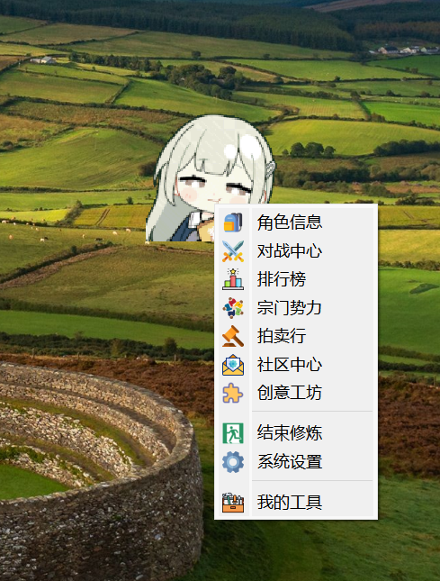
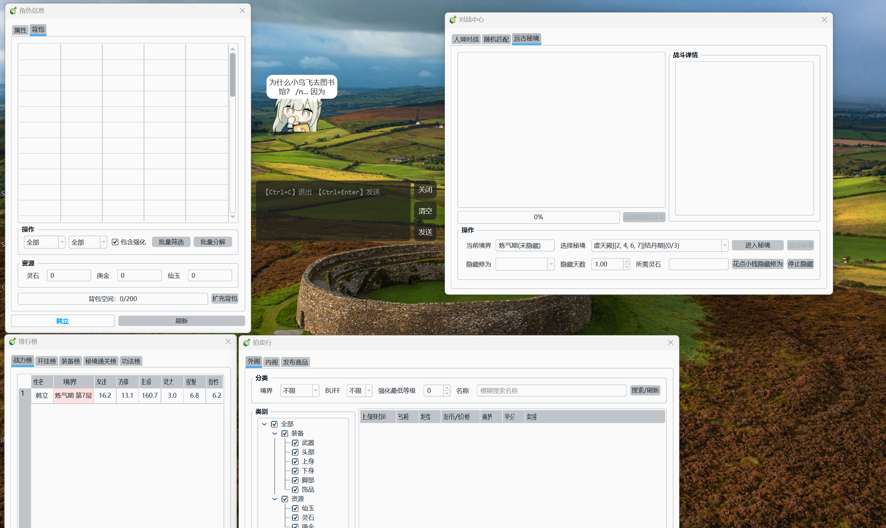
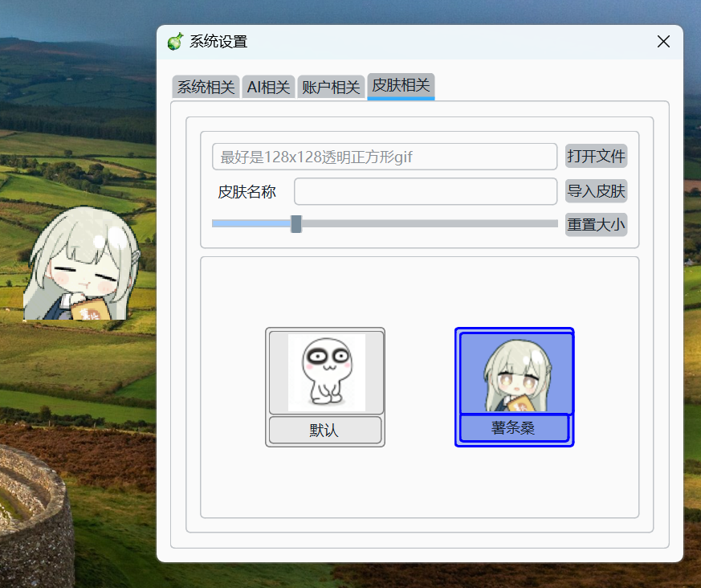

# 🎮 修仙宠物 (Xiuxian Pet)

<p align="center">
  
</p>

<p align="center">
  <b>一个会修仙的桌面宠物，陪伴你摸鱼、修炼、飞升！</b>
</p>

<p align="center">
  
  
  
  
</p>

---

## ✨ 项目简介

**修仙宠物**是一款休闲、幽默风格的桌面宠物游戏，灵感源自《凡人修仙传》。你的桌面上会有一只可爱的小宠物，它会自动修炼、突破境界、穿戴装备，还能陪你聊天解闷！

> 🎯 **核心理念**：工作累了？来看看你的宠物修炼到什么境界了吧！说不定它已经飞升成仙，而你还在写 bug~ 😏

---

## 🖼️ 游戏截图

<p align="center">
  
  
</p>

---

## 🚀 核心功能

### 🎭 桌面宠物系统
- **自动修炼**：宠物会自己打坐修炼，无需操心
- **境界突破**：从炼气期到道祖境，体验完整修仙之路
- **属性成长**：攻击、生命、防御、智慧、悟性、灵力六大属性
- **装备系统**：武器、防具、法宝，打造你的专属神器
- **皮肤切换**：支持 GIF 动画皮肤，让你的宠物与众不同

### 🤖 AI 智能聊天
- **本地大模型**：基于 Ollama，无需联网也能聊天
- **智能感知**：检测系统闲置状态，自动找你聊天
- **多地方言**：东北话、天津话、北京话、四川话、孙笑川风格任选
- **气泡对话**：可爱的气泡对话框，逐字显示动画效果

### 🎮 丰富的游戏玩法

| 功能 | 描述 |
|------|------|
| 🏆 **排行榜** | 与全服玩家比拼修为境界 |
| 🏛️ **宗门系统** | 创建或加入宗门，与道友一起修炼 |
| 🗣️ **世界聊天** | 全服玩家实时交流 |
| 🏪 **拍卖行** | 买卖装备，发家致富 |
| 🗺️ **迷宫探索** | 随机迷宫生成，自动寻路探险 |
| ⚔️ **PVP 对战** | 与其他玩家一决高下 |

### 🔌 插件系统（亮点功能）

> 🌟 **这是本项目最引以为傲的功能！**

我们设计了一套**跨语言插件架构**，让第三方开发者可以用任何语言（Python、Go、C++ 等）为游戏开发插件！

#### 插件系统特点

- 🛡️ **进程隔离**：插件运行在独立进程中，崩溃不影响主程序
- 🔐 **加密通信**：Python 与 Go 之间使用 AES 加密通信
- 📡 **标准化协议**：统一的消息格式，易于开发
- 🔄 **自动重启**：插件崩溃后自动重启，高可用性
- 📦 **创意工坊**：内置插件市场，一键安装热门插件

#### 插件 API 接口

```python
# 获取玩家属性
get_player_attr("attack")  # 获取攻击力

# 设置玩家属性
set_player_attr("cultivation", 99999)  # 修改修为

# 执行系统命令
exec_method("sys_exit")  # 安全退出

# 插件私有数据
set_plugin_attr("my_data", {"level": 99})
```

#### 开发一个插件有多简单？

```go
package main

import (
    "anti-cheat/acore"
)

func main() {
    plugin := acore.NewAntiCPlugin("my_plugin", "我的插件", "1.0.0", "windows", "1.0", 15)
    
    // 连接桥接服务
    if !plugin.Connect("127.0.0.1", 15433) {
        return
    }
    
    // 注册插件
    plugin.Register()
    
    // 启动心跳
    plugin.StartHeartbeat()
    
    // 你的插件逻辑...
    select {}
}
```

### 🛡️ 安全防护

- **反作弊系统**：检测 IDA、x64dbg、Cheat Engine 等逆向工具
- **DLL 注入检测**：实时监控异常模块
- **禁止双开**：防止多开刷资源
- **数据加密**：双层 AES 加密存储游戏数据

---

## 📦 安装与运行

### 开箱即用-Windows

- Windows 10/11

### 运行游戏

```bash
xiuxian_xxx.exe
```

---

## 🎨 技术栈

| 技术 | 用途 |
|------|------|
| Python 3.10+ | 主程序开发 |
| PyQt6 | GUI 界面 |
| Go 1.21+ | 插件服务器 |
| SQLite + AES | 数据存储 |
| Ollama | 本地 AI 模型 |
| Loguru | 日志管理 |

---

## 🤝 参与贡献

我们欢迎任何形式的贡献！

1. Fork 本仓库
2. 创建你的分支 (`git checkout -b feature/AmazingFeature`)
3. 提交更改 (`git commit -m 'Add some AmazingFeature'`)
4. 推送到分支 (`git push origin feature/AmazingFeature`)
5. 创建 Pull Request

### 开发插件

查看 [插件开发文档](docs/plugin_development.md) 了解如何为修仙宠物开发插件。

---

## 📜 许可证

本项目基于 **GNU GPLv3** 许可证发布，并附加**禁止商业收费**条款：

- ✅ 允许：个人学习、研究、非盈利教育用途
- ❌ 禁止：商业销售、收费许可、盈利性使用

查看 [LICENSE](LICENSE) 文件了解完整条款。

---
## ⚠️ 免责声明

### 1. 内网穿透/隧道功能

**本软件提供的隧道功能仅供学习交流和技术研究使用，用户需遵守以下规定：**

- **合法使用**：用户必须确保使用本功能符合所在国家/地区的法律法规
- **禁止非法用途**：不得用于绕过网络审查、访问非法内容、进行网络攻击或任何违法行为
- **网络安全**：用户需自行承担使用内网穿透功能带来的网络安全风险
- **隐私保护**：本软件不记录用户通信内容，但用户需自行保护敏感数据

### 2. 联机游戏功能

- 本软件提供的联机功能旨在方便玩家本地多人游戏体验
- 用户应仅与信任的朋友或授权用户建立连接
- 开发者不对因联机产生的任何纠纷或损失负责

### 3. 软件性质

- 本软件为开源/免费软件，按"原样"提供，不提供任何明示或暗示的担保
- 开发者不对因使用本软件导致的任何直接或间接损失负责
- 包括但不限于：数据丢失、系统损坏、网络问题、法律纠纷等

### 4. 更新和维护

- 开发者保留随时修改、暂停或终止服务的权利
- 不保证软件永久可用或持续更新
- 用户应及时更新到最新版本以获得安全修复

### 5. 最终解释权

本免责声明的解释权归开发者所有。使用本软件即表示您已阅读并同意上述条款。

---

**如不同意以上条款，请立即停止使用本软件。**

---

## 🙏 致谢

- 灵感来源：《凡人修仙传》
- UI 设计：PyQt6

---

<p align="center">
  <b>⭐ 如果本项目对你有帮助，请点个 Star 支持一下！⭐</b>
</p>

<p align="center">
  
</p>

<p align="center">
  <i>祝各位道友修仙顺利，早日飞升！</i> 🎉
</p>
